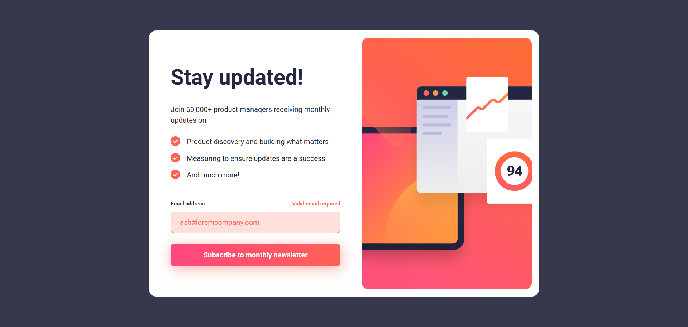

# Frontend Mentor - Newsletter sign-up form with success message solution

This is a solution to the [Newsletter sign-up form with success message challenge on Frontend Mentor](https://www.frontendmentor.io/challenges/newsletter-signup-form-with-success-message-3FC1AZbNrv). Frontend Mentor challenges help you improve your coding skills by building realistic projects. 

## Table of contents

- [Overview](#overview)
  - [The challenge](#the-challenge)
  - [Screenshot](#screenshot)
  - [Links](#links)
- [My process](#my-process)
  - [Built with](#built-with)
  - [What I learned](#what-i-learned)
  - [Useful resources](#useful-resources)
- [Acknowledgments](#acknowledgments)

## Overview

### The challenge

Users should be able to:

- Add their email and submit the form
- See a success message with their email after successfully submitting the form
- See form validation messages if:
  - The field is left empty
  - The email address is not formatted correctly
- View the optimal layout for the interface depending on their device's screen size
- See hover and focus states for all interactive elements on the page

### Screenshot



### Links

- Solution URL: [Frontend Mentor](https://www.frontendmentor.io/solutions/responsive-newsletter-sign-up-with-mainly-flexbox-jDIz9T0cCb)
- Live Site URL: [GitHub live site](https://dorm-24.github.io/newsletter-sign-up/)

## My process

### Built with

- Semantic HTML5 markup
- CSS custom properties
- Flexbox
- CSS Grid
- Mobile-first workflow
- Javascript form manipulation

### What I learned

With this project I've learned a lot. I learned things like how to switch image based on different screen sizes, how to make responsive layouts, and to manage forms in javascript.

```html
<picture class="image-section">
  <source media="(min-width: 768px)" srcset="./assets/images/illustration-sign-up-desktop.svg">
  <source media="(min-width: 375px)" srcset="./assets/images/illustration-sign-up-tablet.svg">
  
</picture>
```

### Useful resources

- https://www.youtube.com/watch?v=Z0duh-0xJ2Y - This helped me for my layout design and how to manage the different pictures on different screen sizes

## Acknowledgments

Special thanks to [Kevin Powell](https://www.youtube.com/@KevinPowell) for his insightful YouTube content. His video on this project inspired parts of my responsive layout design.
